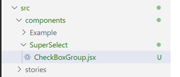

# EXERCISE 1: reactR input component

## Step 1: Set up initial R project


1. TERMINAL: Check out the starting branch

        git checkout step_1

2. Open RStudio

3. Create new project in the Git working dir

4. R CONSOLE: Create new {golem} web app

        golem::create_golem(".", package_name = "jsdemo", overwrite = TRUE)
	
5. In RStudio, open ./dev/run_dev.R.  Run all commands and verify the Shiny app starts.  You
should see something like the following:


&nbsp;  
&nbsp;  

## Step 2: Create R stub for SuperSelect component

1. R CONSOLE: Generate {reactR} stub:

        reactR::scaffoldReactShinyInput("superselect")
		
Notice that three files are created:

- ./R/superselect.R : Functions similiar to Shiny inputs
- ./srcjs/superselect.jsx : Entrypoint to JavaScript
- ./webpack.config.js : Configuration of JavaScript code packager
- ./package.json : Node.js package configuration file

2. Open the file ./R/app_ui.R and insert the following code after line 13:

        # Superselect input
        superselectInput("superselect"),
      
        # Output to display what was selected
        textOutput("mirror")
	  
The full app_ui function should look like:

```
app_ui <- function(request) {
  tagList(
    # Leave this function for adding external resources
    golem_add_external_resources(),
    # Your application UI logic
    fluidPage(
      h1("jsdemo"),
      
      # Superselect input
      superselectInput("superselect"),
      
      # Output to display what was selected
      textOutput("mirror")
    )
  )
}
```

3. Open the file ./R/app_server.R and insert the following code after line 8

```
# Mirror superselect output
  output$mirror <- shiny::renderText({
    input$superselect
  })
```

The full app_server function should look like:

```
app_server <- function(input, output, session) {
  # Your application server logic
  
  # Mirror superselect output
  output$mirror <- shiny::renderText({
    input$superselect
  })
}
```
		
Note that this may take a few minutes to complete.

4. TERMINAL: Execute the following command to package the JavaScript code:

        yarn build

5. R CONSOLE: Execute the commands in ./dev/run_dev.R and then enter text into
the textbox (which is a placeholder for the JavaScript code we are going to write).
You should see something like the following:


&nbsp;  
&nbsp;  

## Step 3: Create React codebase.  NOTE; We are going to skip this during the workshop
**Please skip to Step 4 for the workshop.  This step contains a lot of downtime.**
** I am keeping the steps in the document for your later reference.**

0. OPTIONAL: If you did not complete the previous code sections, run the following commands
in the **TERMINAL** to bring you codebase up to date:

		git checkout -f step_3
		
1. TERMINAL: Initialize React codebase for component library development (as opposed to app development)
using Neutrino

        yarn create @neutrinojs/project srcreact
		
In the wizard select the following options using the arrow keys:

- What would you like to create? Select 'Components'
- What kind of components would you like to create? Select 'React'
- Would you like to add a test runner to your project? Select 'Jest'
- Would you like to add linting to your project? Select 'Airbnb style rules'

2. Initialize Storybook.  In a new **TERMINAL** window, run:

        cd srcreact
        npx storybook init --type react
		
This may take a while.
		
&nbsp;  
&nbsp;  


## Step 4: Create stub for initial React component

0. Run the following commands in the **TERMINAL** to bring you codebase up to date:

		git checkout -f step_4
		
1. Open Storybook by entering the following into a new **TERMINAL**:

        cd srcreact
		yarn storybook
		
Your browser should open to Storybook and you should see something like:


2. Open Visual Studio Code and open the React source code folder (srcreact) by selecting **File > Open Folder** from the menu.

3. On the left navigation pane, open the **src** node and right click on the **components** node as shown in the following figure.


4. Create a new folder named **SuperSelect**.  Afterwards, your source tree should look like the following figure:


5. Right click on the **SuperSelect** folder in the left navigation pane and create a new file named **CheckBoxGroup.jsx**.



6. Copy and past the following code into the file:

```
import React from 'react'

const CheckBoxGroup = () => {
  return <h1>Hello world!</h1>
}

export default CheckBoxGroup
```

7. Right click on the **SuperSelect** folder in the left navigation pane and create a new file named **CheckBoxGroup.stories.jsx**.


8. Copy and past the following code into the file:

```
import React from 'react'
import CheckBoxGroup from './CheckBoxGroup'

export default {
  title: 'CheckBoxGroup',
  component: CheckBoxGroup
}

const Template = args => <CheckBoxGroup {...args} />

export const NoInitialSelections = Template.bind({})
NoInitialSelections.args = {

}
```

9. Go to the Storybook tab in your browser.  Notice the new **CheckBoxGroup** node on the left.
Open it and click on the *No Initial Selections* item.  See the output of your new component in
the main panel.


&nbsp;  
&nbsp;  

## Step 5: Complete initial React component

0. OPTIONAL: If you did not complete the previous code sections, run the following commands
in the **TERMINAL** to bring you codebase up to date:

		git checkout -f step_5

1. Add initial rendering and styling code to **CheckBoxGroup.jsx** by replacing the existing code with
the following.  This new code lays out and formats the checkboxes and labels.

```
import React, {useState} from 'react'

// CSS styles for main DIV
const groupStyle = {
  display: 'flex',
  flexDirection: 'column'
}

// CSS styles for group label
const labelStyle = {
  fontWeight: 'bold'
}

// CSS styles for individual items
const itemStyle = {
  display: 'flex',
  position: 'relative',
  left: '20px'
}

/**
 * A React component that renders a group of checkboxes with a de/select-all parent
 * checkbox.
 * 
 * @param {string} Label for the entire group that is rendered beside the de/select-all
 * checkbox.
 * @param {array} items Objects with label and value properties for which checkboxes
 * are rendered.
 * 
 * @returns JSX.
 */
const CheckBoxGroup = ({groupLabel, items}) => {

  // Render
  return (
    <div style={groupStyle}>

      {/* Group label and de/select-all checkbox */}
      <div style={labelStyle}>
        <label>
          <input
            type='checkbox'
          />
          {groupLabel}
        </label>
      </div>

      {/* Individual items checkbox */}
      <div>
        {
          items.map(item => {
            return (
              <div style={itemStyle} key={item.value}>
                <label>
                  <input
                    type='checkbox'
                  />
                  {item.label}
                </label>
              </div>
            )
          })
        }
      </div>
    </div>
  )
}

export default CheckBoxGroup
```

2. Add new parameters to the **CheckBoxGroup.stories.jsx** story by replacing existing code with:

```
import React from 'react'
import CheckBoxGroup from './CheckBoxGroup'

export default {
  title: 'CheckBoxGroup',
  component: CheckBoxGroup
}

const Template = args => <CheckBoxGroup {...args} />

export const NoInitialSelections = Template.bind({})
NoInitialSelections.args = {
  groupLabel: 'FooBar',
  items: [
    {
      label: 'Foo',
      value: 'foo'
    },
    {
      label: 'Bar',
      value: 'bar'
    }
  ],
}
```

3. Go to **Storybook** tab in browser and view updated UI.


4. Add state management and event handling to **CheckBoxGroup.jsx** by replacing existing code with:

```
import React, {useState} from 'react'

// CSS styles for main DIV
const groupStyle = {
  display: 'flex',
  flexDirection: 'column'
}

// CSS styles for group label
const labelStyle = {
  fontWeight: 'bold'
}

// CSS styles for individual items
const itemStyle = {
  display: 'flex',
  position: 'relative',
  left: '20px'
}

/**
 * A React component that renders a group of checkboxes with a de/select-all parent
 * checkbox.
 * 
 * @param {string} Label for the entire group that is rendered beside the de/select-all
 * checkbox.
 * @param {array} items Objects with label and value properties for which checkboxes
 * are rendered.
 * @param {array} selectedItems Value property of items that should be pre-selected.
 * @param {function} onChange A callback function that accepts two arguments consisting
 * of the group label and an array of currently-selected item values.
 * 
 * @returns JSX.
 */
const CheckBoxGroup = ({groupLabel, items, selectedItems, onChange}) => {

  /**
   * Determines if all items have been individually selected.
   * @param {array} selections Array of item.item values that have been selected.
   * @returns T/F
   */
   const allItemsSelected = selections => {
    let status = true
    items.forEach(item => {
      if (!selections.includes(item.value)) {
        status = false
      }
    })
    return status
  }

  // State of de/select-all checkbox
  const [allSelected, setAllSelected] = useState(allItemsSelected(selectedItems))

  // State consisting of an array of currently selected item values
  const [selected, setSelected] = useState(selectedItems)

  /**
   * Event handler for de/select-all checkbox.
   * @param {object} e JavaScript-generated event.
   */
  const handleChangeSelectAll = e => {
    setAllSelected(e.target.checked)
    const newSelected = e.target.checked? items.map(item => item.value) : []
    setSelected(newSelected)
    onChange(groupLabel, newSelected)
  }

  /**
   * Event handler for item checkboxes.
   * @param {object} e JavaScript-generated event.
   */
  const handleChangeSelectItem = e => {
    let newSelected = []
    if (e.target.checked) {
      newSelected = [...selected, e.target.dataset.itemvalue]
    }
    else {
      newSelected = [...selected.filter(itemVal => e.target.dataset.itemvalue !== itemVal)]
      setAllSelected(false)
    }
    setSelected(newSelected)
    setAllSelected(allItemsSelected(newSelected))
    onChange(groupLabel, newSelected)
  }

  // Render
  return (
    <div style={groupStyle}>

      {/* Group label and de/select-all checkbox */}
      <div style={labelStyle}>
        <label>
          <input
            type='checkbox'
            checked={allSelected}
            onChange={handleChangeSelectAll}
          />
          {groupLabel}
        </label>
      </div>

      {/* Individual items checkbox */}
      <div>
        {
          items.map(item => {
            return (
              <div style={itemStyle} key={item.value}>
                <label>
                  <input
                    type='checkbox'
                    checked={selected.includes(item.value)}
                    onChange={handleChangeSelectItem}
                    data-itemvalue={item.value}
                  />
                  {item.label}
                </label>
              </div>
            )
          })
        }
      </div>
    </div>
  )
}

export default CheckBoxGroup
```

5. Add additional Storybook tests by replace code in **CheckBoxGroup.stories.jsx** with the following:

```
import React from 'react'
import CheckBoxGroup from './CheckBoxGroup'

export default {
  title: 'CheckBoxGroup',
  component: CheckBoxGroup
}

const Template = args => <CheckBoxGroup {...args} />

const handleOnChange = (groupLabel, selected) => {
  console.log(groupLabel)
  console.log(selected)
}

export const NoInitialSelections = Template.bind({})
NoInitialSelections.args = {
  groupLabel: 'FooBar',
  items: [
    {
      label: 'Foo',
      value: 'foo'
    },
    {
      label: 'Bar',
      value: 'bar'
    }
  ],
  selectedItems: [],
  onChange: handleOnChange
}

export const WithInitialSelections = Template.bind({})
WithInitialSelections.args = {
  groupLabel: 'FooBar',
  items: [
    {
      label: 'Foo',
      value: 'foo'
    },
    {
      label: 'Bar',
      value: 'bar'
    }
  ],
  selectedItems: ['foo'],
  onChange: handleOnChange
}

export const AllSelected = Template.bind({})
AllSelected.args = {
  groupLabel: 'FooBar',
  items: [
    {
      label: 'Foo',
      value: 'foo'
    },
    {
      label: 'Bar',
      value: 'bar'
    }
  ],
  selectedItems: ['foo', 'bar'],
  onChange: handleOnChange
}
```

6.  Go to the Storybook tab in your browser and see there are now three test cases.  Interact with the
tests to verify the required behavior is correct.  Open the browser JavaScript console (CTRL-Shift-I) to view the
event handler output.


&nbsp;  
&nbsp;  


## Step 6: Add unit tests

0. OPTIONAL: If you did not complete the previous code sections, run the following commands
in the **TERMINAL** to bring you codebase up to date:

		git checkout -f step_6

1. In **VS Code**, create directories for unit testing:

- Right click on the **test** node in the left navigation pane.
- Create a new folder named **components**.
- Right click on the new **components** folder and create a folder named **SuperSelect**
- Right click on the **SuperSelect** folder and create a file named **CheckBoxGroup_test.js**.

Your source tree should look like the following:


2. Copy the following code into **CheckBoxGroup_test.js**:

```
import React from 'react'
import { render, screen, fireEvent } from '@testing-library/react'
import '@testing-library/jest-dom'
import CheckBoxGroup from '../../../src/components/SuperSelect/CheckBoxGroup'

// Group label for checkboxgroup
const groupLabel = "FooBar"

// Items in checkboxgroup
const items = [
  {
    label: 'Foo',
    value: 'foo'
  },
  {
    label: 'Bar',
    value: 'bar'
  }
]

// Dummy event handler
const handleOnChange = () => "Do nothing"

// Render a checkboxgroup
const setUpTests = selectedItems => {
  render(
    <CheckBoxGroup 
      groupLabel={groupLabel}
      items={items}
      selectedItems={selectedItems}
      onChange={handleOnChange}
    />
  )
}

// Run the tests
describe("<CheckBoxGroup />", () => {

  // Test 1
  test("Should render correctly with no items selected", () => {
    setUpTests([])

    // Verify group label rendered correctly
    expect(screen.getByLabelText(groupLabel)).toBeInTheDocument()
    expect(screen.getByLabelText(groupLabel)).not.toBeChecked()

    // Verify each item rendered correclty
    items.forEach(item => {
      const checkbox = screen.getByLabelText(item.label)
      expect(checkbox).toBeInTheDocument()
      expect(checkbox).not.toBeChecked()
    })
  })

  // Test 2
  test("Should render correctly with one item selected", () => {
    const selectedItems = ['foo']
    setUpTests(selectedItems)

    // Verify group label rendered correctly
    expect(screen.getByLabelText(groupLabel)).toBeInTheDocument()
    expect(screen.getByLabelText(groupLabel)).not.toBeChecked()

    // Verify each item rendered correclty
    items.forEach(item => {
      const checkbox = screen.getByLabelText(item.label)
      expect(checkbox).toBeInTheDocument()
      if (selectedItems.includes(item.value)) {
        expect(checkbox).toBeChecked()
      } else {
        expect(checkbox).not.toBeChecked()
      }
    })
  })

  // Test 3
  test("Should render correctly with all items selected", () => {
    const selectedItems = ['foo', 'bar']
    setUpTests(selectedItems)

    // Verify group label rendered correctly
    expect(screen.getByLabelText(groupLabel)).toBeInTheDocument()
    expect(screen.getByLabelText(groupLabel)).toBeChecked()

    // Verify each item rendered correclty
    items.forEach(item => {
      const checkbox = screen.getByLabelText(item.label)
      expect(checkbox).toBeInTheDocument()
      if (selectedItems.includes(item.value)) {
        expect(checkbox).toBeChecked()
      } else {
        expect(checkbox).not.toBeChecked()
      }
    })
  })

  // Test 4
  test("Select-all checkbox works", () => {
    const selectedItems = []
    setUpTests(selectedItems)

    // Verify all item checkboxes unchecked
    items.forEach(item => {
      expect(screen.getByLabelText(item.label)).not.toBeChecked()
    })

    // Click select-all
    const selectAll = screen.getByLabelText(groupLabel)
    fireEvent.click(selectAll)

    // Verify all item checkboxes checked
    items.forEach(item => {
      expect(screen.getByLabelText(item.label)).toBeChecked()
    })

    // Click select-all again
    fireEvent.click(selectAll)

    // Verify all item checkboxes unchecked
    items.forEach(item => {
      expect(screen.getByLabelText(item.label)).not.toBeChecked()
    })
  })

  // Test 5
  test("Select-all auto-checked when all items checked", () => {
    setUpTests([])

    // Verify select-all initiall unchecked
    const selectAll = screen.getByLabelText(groupLabel)
    expect(selectAll).not.toBeChecked()

    // Select all items
    items.forEach(item => {
      fireEvent.click(screen.getByLabelText(item.label))
    })

    // Verify select-all checked
    expect(selectAll).toBeChecked()

    // Unclick an item
    fireEvent.click(screen.getByLabelText(items[0].label))

    // Verify select-all unchecked
    expect(selectAll).not.toBeChecked()
  })
})
```

3. In the **terminal**, type the following

        yarn test
		
&nbsp;  
&nbsp;  


## Step 7: Finish the **SuperSelect** components

1. Check out Git branch to add test data:

        git checkout -f step_7

2. In the left navigation pane, right click on the **src/components/SuperSelect** node and create
a new file named **CheckBoxGroups.jsx**.

You should see the following:


3. Copy the following code into **CheckBoxGroups.jsx**:

```
import React from 'react'
import CheckBoxGroup from './CheckBoxGroup.jsx'

// CSS styles for main DIV
const groupsStyle = {
  display: 'flex',
  flexDirection: 'column',
  flexWrap: 'wrap',
  minWidth: '800px',
  maxHeight: '80vh'
}

// CSS styles for individual CheckBoxGroup components
const groupStyle = {
  margin: '10px'
}

/**
 * A React component that renders a set of CheckBoxGroup components
 * column-wise.
 * 
 * @param {array} elements Objects of the structure expected by CheckBoxGroup.
 * @param {array} selectedItems Strings equivalent to item.value.
 * @param {function} onChange A callback function that accepts two arguments consisting
 * of a group label and an array of currently-selected item values.
 * 
 * @returns JSX
 */
const CheckBoxGroups = ({elements, selectedItems, onChange}) => {
  
  return (
    <div style={groupsStyle}>
      {
        elements.map(element => {
          const selected = []
          element.items.forEach(item => {
            if (selectedItems.includes(item.value)) {
              selected.push(item.value)
            }
          })
          return (
            <div style={groupStyle} key={element.groupLabel}>
              <CheckBoxGroup
                groupLabel={element.groupLabel}
                items={element.items}
                selectedItems={selected}
                onChange={onChange}
              />
            </div>
          )
        })
      }
    </div>
  )
}

export default CheckBoxGroups
```

4. In the left navigation pane, right click on the **src/components/SuperSelect** node and create
a new file named **CheckBoxGroups.stories.jsx**.

You should see the following:


5. Copy the following code into **CheckBoxGroups.stories.jsx**:

```
import React from 'react'
import CheckBoxGroups from './CheckBoxGroups'
import { testItems } from './data/test-data'

export default {
  title: 'CheckBoxGroups',
  component: CheckBoxGroups
}

const Template = args => <CheckBoxGroups {...args} />

export const NoInitialSelections = Template.bind({})
NoInitialSelections.args = {
  elements: testItems,
  selectedItems: [],
  onChange: (groupLabel, selected) => {
    console.log(groupLabel)
    console.log(selected)
  }
}

export const WithInitialSelections = Template.bind({})
WithInitialSelections.args = {
  elements: testItems,
  selectedItems: ['BASOSI', 'LDLSI', 'AMYLSI'],
  onChange: (groupLabel, selected) => {
    console.log(groupLabel)
    console.log(selected)
  }
}
```

6. Open to the **StoryBook** tab in your browser. You should see new items for **CheckBoxGroups**:


7. In the left navigation pane, right click on the **src/components/SuperSelect** node and create
a new file named **SuperSelect.jsx**.


8. Copy the following code into **SuperSelect.jsx**:

```
import React, { useState } from 'react'
import Modal from 'react-modal'
import CheckBoxGroups from './CheckBoxGroups.jsx'

// CSS styles for modal dialog.
const style = {
  content: {
    width: 'fit-content',
    height: 'fit-content'
  }
}

/**
 * A React component that provides a button opening a modal dialog allowing
 * users to select items from groups of checkboxes.
 * 
 * @param {array} Objects of the structure expected by CheckBoxGroup.
 * @param {onChange} A callback function accepting a single argument containing
 * selected item.value values that is triggered when the modal dialog is closed.
 * 
 * @returns JSX
 */
const SuperSelect = ({ elements, onChange }) => {

  // State determining whether the modal is visible or not
  const [isVisible, setIsVisible] = useState(false)

  // State holding an object who attributes map to check box
  // group labels and whose values are arrays of selected item.value values
  const [selectedItems, setSelectedItems] = useState({})

  /**
   * Event handler for when open button is clicked.
   */
  const handleOpenButtonClick = () => {
    setIsVisible(true)
  }

  /**
   * Event handler for when close button is clicked.
   */
  const handleCloseButtonClick = () => {
    setIsVisible(false)
    const selected = extractSelectedList(selectedItems)
    onChange(selected)
  }

  /**
   * Helper function to extract selected item.value values
   * from the selectedItems state as an array.
   * 
   * @param {object} selectedItems The selectedItems state object.
   * @returns An array containing selected item.value values.
   */
  const extractSelectedList = selectedItems => {
    return Object.keys(selectedItems).reduce((cumulative, groupLabel) => {
      return cumulative.concat(selectedItems[groupLabel])
    }, [])
  }

  /**
   * Callback function to pass to the CheckBoxGroups nested component that is
   * triggered each time the user de/selects and checkbox.
   * @param {string} groupLabel A checkbox group label.
   * @param {*} itemValues The item.value values associated with selected
   * checkboxes.
   */
  const onSelectionsChange = (groupLabel, itemValues) => {
    const newSelectedItems = Object.assign({}, selectedItems)
    newSelectedItems[groupLabel] = itemValues
    setSelectedItems(newSelectedItems)
  }

  // Render
  return (
    <div>
      <button type='button' onClick={handleOpenButtonClick}>Select Items</button>
      <Modal isOpen={isVisible} style={style} ariaHideApp={false}>
        <CheckBoxGroups elements={elements} selectedItems={extractSelectedList(selectedItems)} onChange={onSelectionsChange} />
        <button type='button' onClick={handleCloseButtonClick}>Close</button>
      </Modal>
    </div>
  )
}

export default SuperSelect
```

9. In the left navigation pane, right click on the **src/components/SuperSelect** node and create
a new file named **SuperSelect.stories.jsx**.


10. Copy the following code into **SuperSelect.stories.jsx":

```
import React from 'react'
import SuperSelect from './SuperSelect'
import { testItems } from './data/test-data'

export default {
  title: 'SuperSelect',
  component: SuperSelect
}

const Template = args => <SuperSelect {...args} />

export const NormalCase = Template.bind({})
NormalCase.args = {
  elements: testItems,
  onChange: selected => {
    console.log(selected)
  }
}
```

11. Open the **Storybook** tab in your browser and view the **SuperSelect** stories.
Click on the **SelectItems** button.


&nbsp;  
&nbsp;  


## Step 8: Connect R and JavaScript code

0. OPTIONAL: If you did not complete the previous code sections, run the following commands
in the **TERMINAL** to bring you codebase up to date:

		git checkout -f step_8

1. In **RStudio** open **./srcjs/superselect.jsx**.

2. Replace the existing code in **superselect.jsx** with the following:

```
import { reactShinyInput } from 'reactR';
import SuperSelect from '../srcreact/src/components/SuperSelect/SuperSelect.jsx';

/**
 * Glue code to connect our React components to the R input.  Note that
 * this code runs in the browser and communicates with Shiny like any other
 * input.
 *
 * @param configuration An object containing parameters to pass from
 * R to the React components.
 * @param value Initial value.  Will be null in this case.
 * @param setValue Callback to propagate input changes back to R.
 */
const input = ({ configuration, value, setValue }) => {
  return(
    <div>
      <SuperSelect
        elements={configuration.elements}
        onChange={selected => setValue(selected)}
      />
    </div>
  )
}

reactShinyInput('.superselect', 'jsdemo.superselect', input);
```

3. Open **./R/superselect.R** and replace the **superselectInput()** function code with:

```
#' Generate a SuperSelect input.
#'
#' @param inputId ID of the input.
#' @param lab_param_tree A named list representing a 2-level tree of lab
#' params.  The first level represents the lab category and maps to the
#' SupserSelect group name.  The list values include properties required
#' by the SuperSelect.
#'
#' @importFrom reactR createReactShinyInput
#' @importFrom htmltools htmlDependency tags
#'
#' @export
superselectInput <- function(inputId, lab_param_tree = list()) {
  reactR::createReactShinyInput(
    inputId,
    "superselect",
    htmltools::htmlDependency(
      name = "superselect-input",
      version = "1.0.0",
      src = "www/jsdemo/superselect",
      package = "jsdemo",
      script = "superselect.js"
    ),
    list(),
    list(
      elements = lab_param_tree
    ),
    htmltools::tags$span
  )
}
```

4. Open **./R/app_ui.R** and replace the **app_ui()** function code with:

```
app_ui <- function(request) {
  tagList(
    # Leave this function for adding external resources
    golem_add_external_resources(),
    # Your application UI logic
    fluidPage(
      h1("jsdemo"),
      
      # Superselect input
      superselectInput("superselect", lab_param_tree = adlb_params),
      
      # Output to display what was selected
      textOutput("mirror")
    )
  )
}
```

5. TERMINAL: Enter the following command into the terminal:

        yarn webpack

Notice that the files in the directory **./inst/www/jsdemo/superselect** have been updated.
All of the JavaScript code we wrote plus the necessary extract from third party packages
have been packaged together.  Open the file **superselect.js** for fun!

6. OPTIONAL: If you did not complete the previous code sections, run the following commands
in the **TERMINAL** to bring you codebase up to date:

		git checkout -f ex_1_final
		
7. Open the file **./dev/run_dev.R** and run all commands.  You should see the following
when you click on the **jsdemo** button:


