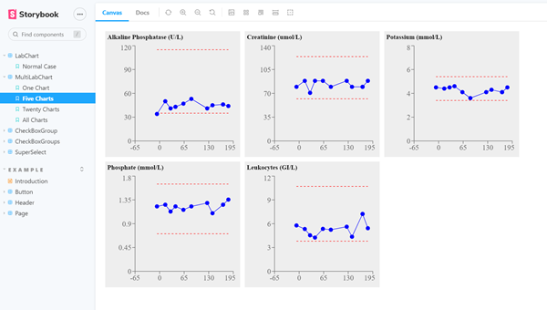
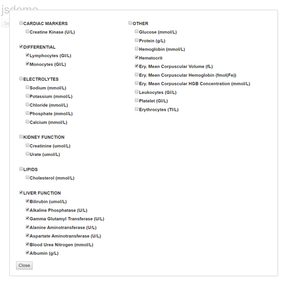
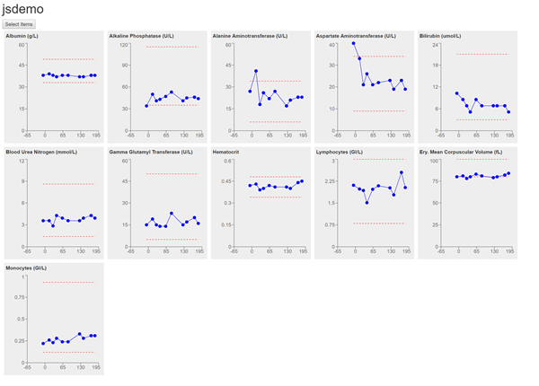

# Exercise 2: HTMLWidget Output

## Step 9: Create HTMLWidget stub code

1. Open **RStudio**

2. CONSOLE: In the R console, enter the following command:

        reactR::scaffoldReactWidget("mlchart")
		
Note several new files:
- mlchart.R : R interface
- mlchart.yaml : Not needed.  Will package code using **webpack**.
- mlchart.jsx : JavaScript glue code

&nbsp;  
&nbsp;  

## Step 10: Implement React code

1. In the **TERMINAL** check out **step_10** branch from Git to reveal React code:

        git checkout -f step_10
		
2. Open **VS Code** and note there is a new component directory
in the left navigation pane: **src/components/MultiLabChart**.

3. Note there are 4 files in this directory:

- LabChart.jsx
- LabChart.stories.jsx
- MultiLabChart.jsx
- MultiLabChart.stories.jsx

4. Go to the **Storybook** tab in your browser.  If you do not see
the new stories under **LabChart** and **MultiLabChart**, restart
the terminal window where you launched it, kill the process
(e.g. enter CTRL-C several times), then restart:

        yarn storybook
		
You should see the following:

5. Click on the different stories under **LabChart** and **MultiLabChart**.
Try resizing your browser and seeing how the charts adapt.

&nbsp;  
&nbsp;  

## Step 11: Connect React and R code

1. Check out **step_11** branch from Git to reveal new code connecting React and R.

        git checkout -f step_11

2. In **RStudio**, note changes to the following files:

- mlchart.R
- app_ui.R
- app_server.R
- mlchart.jsx
- webpack.config.js

3. TERMINAL: In the terminal window, run the following command to package
JavaScript code:

        yarn webpack
		
4. Open **./dev/run_dev.R** in **RStudio** and execute all commands to run the app.  Try
selecting different lab parameters and viewing the charts.

